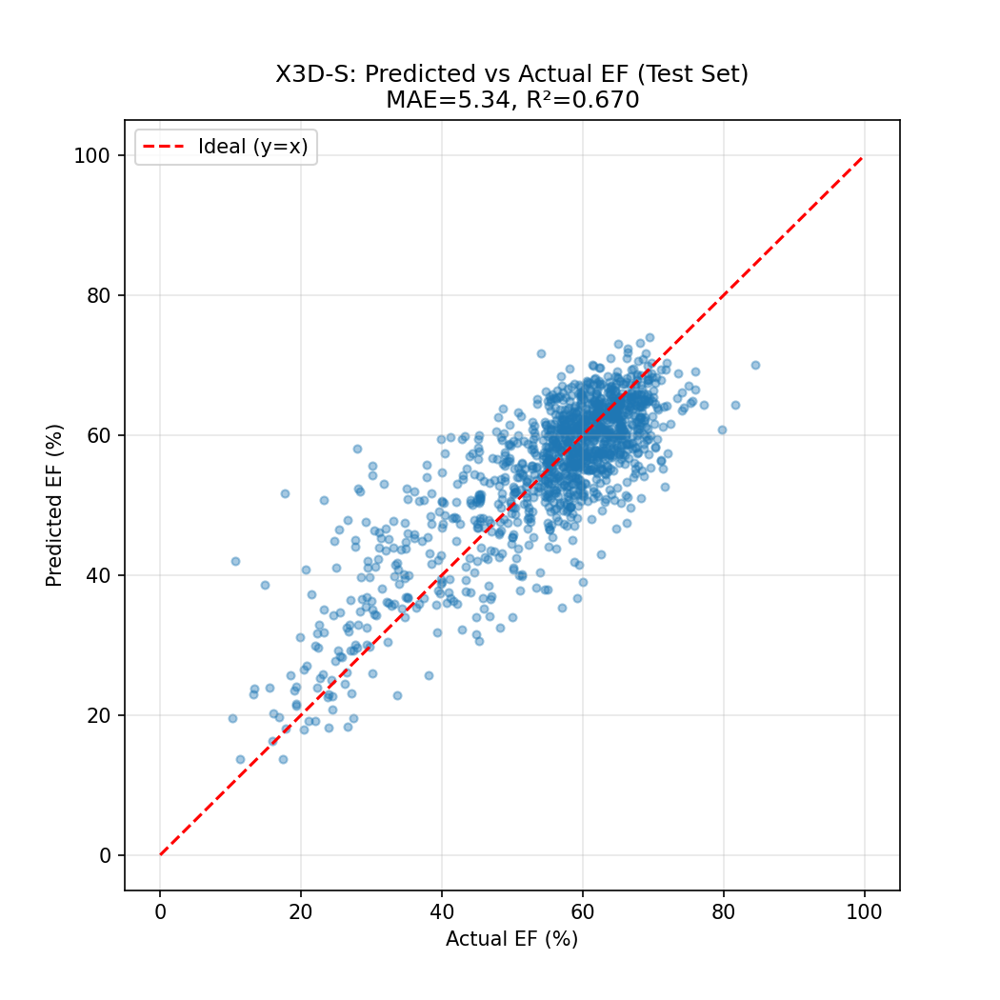
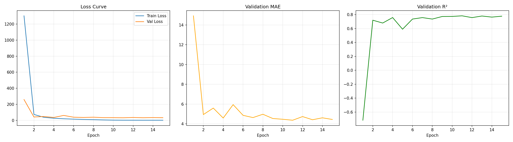
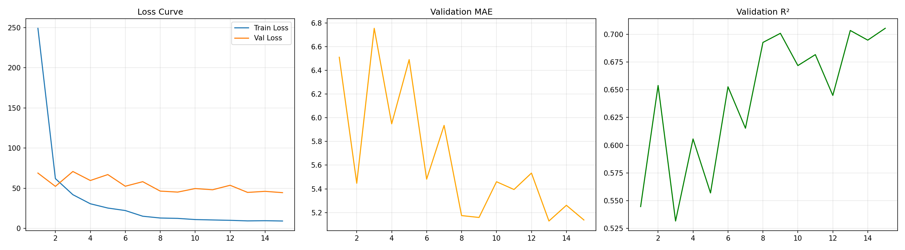
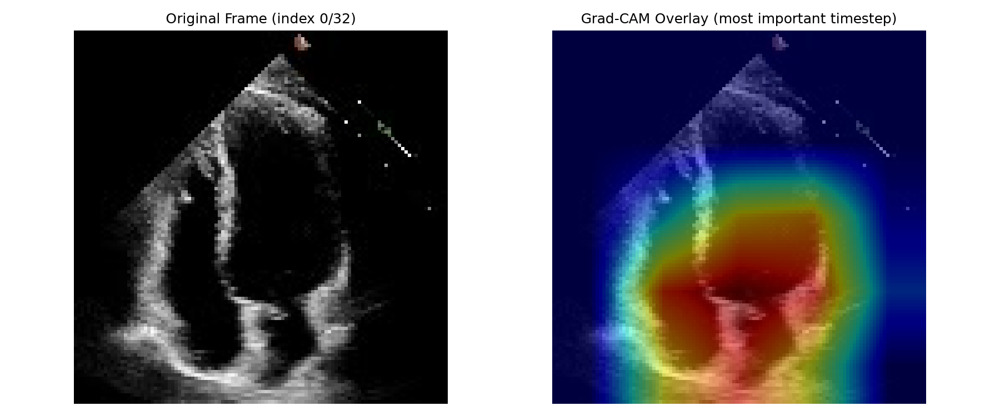
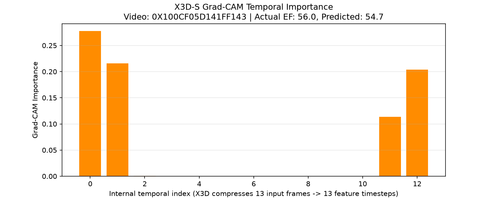

# EchoAI-X: Explainable & Efficient AI for Echocardiography-based Cardiac Function Assessment

> A lightweight, explainability-focused deep learning pipeline for Left Ventricular Ejection Fraction (LVEF) estimation from echocardiography video, built on the EchoNet-Dynamic dataset.

## Overview

Left Ventricular Ejection Fraction (LVEF) is a critical clinical measure of heart function, traditionally estimated manually by cardiologists — a process prone to inter-observer variability. This project investigates whether a **significantly smaller, more efficient deep learning model** can estimate LVEF from echocardiogram video with competitive accuracy, while also rigorously evaluating whether post-hoc explainability methods (Grad-CAM) produce **clinically meaningful** attention patterns.

The core engineering question driving this project: *can a model with 88% fewer parameters than a standard 3D-CNN baseline retain clinically useful accuracy — and can we trust what it claims to "see"?*

## Key Results

| Model | Test MAE | Test RMSE | Test R² | Parameters | vs Baseline |
|---|---|---|---|---|---|
| **r3d_18 (baseline, 3D-ResNet)** | 4.50 | 5.98 | 0.761 | 33.17M | — |
| **X3D-S (proposed, lightweight)** | 5.34 | 7.02 | 0.670 | 3.79M | **88.6% fewer parameters** |
| MTA-Net (MobileNetV2 + Temporal Attention, exploratory) | 6.02 | 8.25 | 0.545 | 2.39M | 92.8% fewer parameters |

**Reference benchmarks from published literature:** original EchoNet-Dynamic model (MAE 4.05, R² 0.81), EFNet 2024 (MAE 3.7, R² 0.82) — included here for context, not as direct experimental comparisons.

<table>
<tr>
<td></td>
<td></td>
</tr>
<tr>
<td align="center">Baseline (r3d_18) training curves</td>
<td align="center">Proposed model (X3D-S) training curves</td>
</tr>
</table>

### Explainability: A Rigorously Tested Finding

Rather than relying on a single qualitative example, attention alignment was tested statistically across 30 held-out test videos, comparing Grad-CAM temporal-attention peaks against clinically-annotated End-Diastole/End-Systole frames.

<table>
<tr>
<td></td>
<td></td>
</tr>
<tr>
<td align="center">Spatial Grad-CAM overlay — attention localizes near the LV chamber</td>
<td align="center">Temporal importance curve for a sample video</td>
</tr>
</table>

**Finding:** No statistically significant positive alignment was found between Grad-CAM attention peaks and annotated ED/ES frames — in fact a significant *negative* association (ratio = 0.33, paired t-test p = 0.0007), traced to sparse ReLU-gated activation in the temporal CAM signal rather than genuine content-driven attention. This result is reported transparently rather than omitted, and directly motivates exploring inherently-interpretable architectures (e.g., the attention-based MTA-Net variant explored above) over post-hoc explanation methods.

## Repository Structure

EchoAI-X/
├── data/ # Raw + processed data (gitignored — see Data Access below)
├── models/ # Trained model checkpoints (gitignored, large files)
├── notebooks/
│ ├── 01_Dataset_Overview.ipynb # Exploratory data analysis on EchoNet-Dynamic
│ ├── 02_Preprocessing.ipynb # Video → frame extraction pipeline
│ └── 03_GradCAM_Explainability.ipynb # Post-hoc explainability analysis
├── reports/
│ ├── baseline_r3d18/ # Baseline model results, training curves, scatter plots
│ └── x3d_novel_model/ # Proposed model results, Grad-CAM analysis
├── src/ # Reusable Python modules
└── README.md

## Dataset

**EchoNet-Dynamic** (Stanford University) — 10,030 apical-4-chamber echocardiogram videos with expert-annotated End-Diastolic/End-Systolic frames, LV tracings, and ground-truth EF values.

**Access:** This project uses EchoNet-Dynamic under Stanford AIMI's Data Use Agreement. The raw dataset is **not included in this repository** in compliance with the DUA. Access can be requested directly from [Stanford AIMI](https://stanfordaimi.azurewebsites.net/).

## Methodology

1. **Preprocessing** — Videos uniformly sampled to 32 frames, resized to 112×112, normalized. 10,010 of 10,030 videos processed successfully with zero corrupted samples.
2. **Baseline model** — `r3d_18` (3D-ResNet-18), Kinetics-400 pretrained, fine-tuned for EF regression.
3. **Proposed model** — `X3D-S` (Meta AI's efficient video architecture), Kinetics pretrained, fine-tuned for EF regression — selected for native 3D temporal convolutions at a fraction of the parameter count of standard 3D-CNNs.
4. **Explainability** — 3D Grad-CAM applied to the final residual stage, validated statistically against clinically-annotated ED/ES frames rather than through single-sample qualitative inspection alone.
5. All models trained on Kaggle (GPU T4×2), 15 epochs, Adam optimizer, MSE loss, ReduceLROnPlateau scheduling.

## Tech Stack

`Python` · `PyTorch` · `PyTorchVideo` · `OpenCV` · `Kaggle Notebooks` · `scikit-learn` · `pandas` · `matplotlib`

## Author

**Asif Nawaz**
Healthcare Data Scientist | MPhil Economics (ML/AI applications in healthcare resource allocation and public-sector efficiency) | Healthcare AI Engineer

- GitHub: [Asif5588-M](https://github.com/Asif5588-M)
- Related work: Clinical NER (BioBERT), Healthcare Expenditure Analytics, Drug Sentiment Analysis, Medical RAG Systems, Skin Lesion Classification, Colon Polyp Segmentation

## Data Use & Compliance

This repository does not host or redistribute EchoNet-Dynamic data or model weights trained on it, in compliance with the Stanford AIMI Data Use Agreement. Code is provided for methodological transparency and reproducibility by researchers with their own approved dataset access.